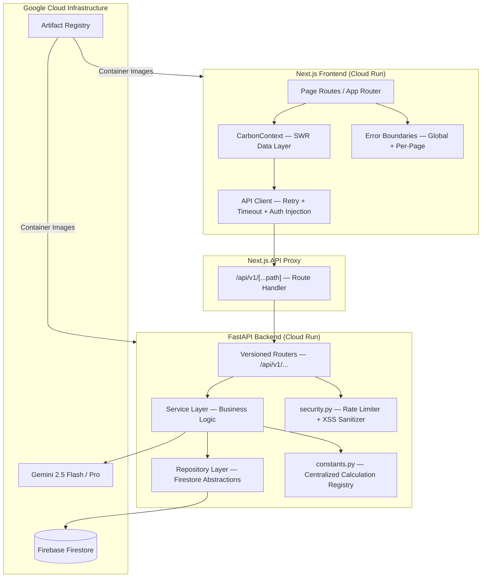

# CarbonTwin AI 🌿


> **CarbonTwin AI** is a full-stack, cloud-native Digital Carbon Twin platform. Users complete structured footprint assessments, receive a Carbon Score, generate a behavioral Digital Twin, run multi-lever impact simulations, commit to Eco Action missions, and track verified long-term progress — all accelerated by a Google Gemini-powered Sustainability Coach.

## 🚀 Live Demo

| Service | URL |
|---------|-----|
| **Frontend** | [carbon-twin-frontend-92195738880.asia-south1.run.app](https://carbon-twin-frontend-92195738880.asia-south1.run.app) |
| **Backend API** | [carbon-twin-backend-92195738880.asia-south1.run.app/health](https://carbon-twin-backend-92195738880.asia-south1.run.app/health) |
| **API Docs** | [/docs](https://carbon-twin-backend-92195738880.asia-south1.run.app/docs) |

---

## 📌 Problem Statement

Personal carbon tracking tools fail in four critical ways:

| Problem | Impact |
|---------|--------|
| **Static calculations** | A single number with no feedback loop or explainability |
| **No temporal context** | Users cannot see how small changes compound over 1, 5, or 10 years |
| **Generic recommendations** | Advice ignores household size, local feasibility, and individual behavior patterns |
| **No persistence** | Scenarios are lost on page close, preventing any progress tracking |

CarbonTwin AI solves all four by moving from a passive calculator to an active, persistent Digital Twin platform.

---

## 🔄 What Makes CarbonTwin Different

### Traditional Carbon Calculator
```
User inputs data → Single metric output → No follow-up
```

### CarbonTwin AI — Digital Carbon Twin Platform
```
User Assessment
      ↓
  Carbon Engine  ←── Emission factors from centralized constants registry
      ↓
  Carbon Score   ←── Normalized 0–100 scoring against 2T–20T thresholds
      ↓
  Twin Profiling  ←── Deterministic archetype assignment (5 behavioral profiles)
      ↓
Future Projection  ←── 3-state model: Current / Committed (Future) / Potential
      ↓
Impact Simulation  ←── Multi-lever sandbox: 15 toggleable lifestyle variables
      ↓
  Eco Actions    ←── Mission lifecycle: Suggested → Active → Check-ins → Completed
      ↓
Progress Tracking  ←── Verified time-series carbon score history + achievements
      ↓
  Gemini Coach   ←── Context-aware AI with full access to user's assessment data
```

Each stage is persisted to Firestore. Each state transition is an explicit API call with Pydantic validation. Each result is typed end-to-end from backend schema to frontend TypeScript interface.

---

## 🏗️ System Architecture



### Layer Responsibilities

| Layer | Technology | Responsibility |
|-------|-----------|----------------|
| **Presentation** | Next.js App Router + TypeScript | UI rendering, routing, form orchestration |
| **Data Layer** | SWR + CarbonContext | Client-side caching, deduplication, revalidation |
| **API Client** | `src/lib/api/client.ts` | Retry logic, timeout, auth header injection |
| **API Proxy** | Next.js Route Handler | CORS isolation, backend URL abstraction |
| **Application** | FastAPI + Pydantic v2 | Request validation, business logic, orchestration |
| **Service Layer** | Python services | Carbon math, twin profiling, simulator, recommendations |
| **Constants Layer** | `app/core/constants.py` | Single source of truth for all emission factors |
| **Persistence** | Firebase Firestore | User data, assessments, twin states, missions |
| **AI Layer** | Google Gemini | Sustainability coaching, AI narrative generation |

---

## 💻 Technology Stack

### Frontend
| Technology | Version | Purpose |
|------------|---------|---------|
| Next.js | 15.x (App Router) | Full-stack React framework, SSR/SSG |
| TypeScript | Strict | End-to-end type safety |
| Auth.js (NextAuth) | v5 | Authentication orchestration |
| SWR | 2.x | Data fetching, caching, deduplication |
| Recharts | 2.x | Carbon breakdown visualizations |
| Vanilla CSS | — | Design system (no utility framework) |

### Backend
| Technology | Version | Purpose |
|------------|---------|---------|
| FastAPI | 0.115.x | High-performance async Python API |
| Pydantic | v2 | Request validation and schema definition |
| Uvicorn | — | ASGI server |
| Pytest | 8.x | Test framework (108+ tests) |
| `pydantic-settings` | v2 | Environment variable management |

### Infrastructure
| Service | Purpose |
|---------|---------|
| Firebase Firestore | NoSQL document persistence |
| Firebase Admin SDK | Server-side Firestore access via ADC |
| Google Gemini (`google-genai`) | AI coaching and narrative generation |
| Google Cloud Run | Serverless containerized deployment |
| Google Artifact Registry | Container image storage and versioning |

---

## ⚙️ Engineering Excellence

### Centralized API Client (`src/lib/api/client.ts`)

All frontend network requests are routed through a single typed client with:
- **Automatic retry**: Exponential backoff (500ms → 1000ms) on network errors and `AbortError`
- **Request timeout**: Configurable per-request (default 8 seconds) via `AbortController`
- **Auth injection**: Automatically reads `X-User-Id` from the active session on every request
- **Typed responses**: Full generic type inference `api.get<T>()`, `api.post<T>()`

```typescript
// Every request has retry, timeout, and session-aware auth injection
const data = await api.post<SimulatorResponse>("/api/v1/simulator/calculate", {
  levers: debouncedLevers
});
```

### Centralized Constants Registry

All emission factors, scoring thresholds, financial assumptions, and simulator multipliers live in a single file:

**Backend:** `backend/app/core/constants.py` — 158 lines, 50+ named constants  
**Frontend:** `frontend/src/lib/constants.ts` — mirrors factors used for client-side estimation

```python
# All services import from a single source of truth
VEHICLE_FACTORS = { "gasoline": 0.192, "hybrid": 0.109, "electric": 0.053, ... }
SCORE_THRESHOLD_EXCELLENT_TONS = 2.0
SOLAR_INSTALLATION_COST_USD = 2500.0
DIET_TRANSITION_SAVINGS_TABLE = { "high_meat": { "vegetarian": 400.0, ... } }
```

This eliminates magic numbers across `carbon_service.py`, `twin_service.py`, `simulator_service.py`, `recommendation_service.py`, and `assessment.py`.

### Shared Domain Type System (`src/types/carbon.ts`)

A single 364-line TypeScript file defines all domain interfaces shared across the application:
`AssessmentData`, `CarbonData`, `TwinData`, `TwinProfile`, `SimulatorResponse`, `SavedScenario`, `EcoMission`, `ProgressData`, `OverviewData`, `BadgeProgress`, and more.

### Async State Management

Every async operation in the UI guarantees three states:

| State | Implementation |
|-------|---------------|
| **Loading** | Spinner or loading text via `loading` state or SWR `isLoading` |
| **Error** | Red alert banner with error message and **Retry** button |
| **Recovery** | Retry callback re-invokes the original async operation |

### SWR Caching and Request Deduplication

The `CarbonContext` provider uses SWR with a 10-minute deduplication interval for the dashboard overview:

```typescript
const { data, error, isLoading, mutate } = useSWR(
  userId ? "/api/v1/dashboard/overview" : null,
  fetcher,
  { revalidateOnFocus: false, dedupingInterval: 10 * 60 * 1000 }
);
```

This prevents redundant API calls when navigating between dashboard pages.

### Error Boundaries

Two-layer error containment:

1. **Global boundary**: `src/app/(dashboard)/error.tsx` — catches unhandled rendering exceptions across the entire dashboard route group, logging via the structured logger and offering Reset + Home recovery
2. **Per-page boundaries**: `ErrorBoundary` component wrapping every page export, providing feature-level fault isolation

### API Versioning

All backend routes are versioned under `/api/v1/` prefix. The Next.js proxy at `app/api/v1/[...path]` maintains a stable frontend URL space while decoupling frontend deployment from backend versioning.

### Input Validation — Backend

All request bodies are validated by Pydantic v2 schemas before reaching service code:
- Enum enforcement for vehicle types, food categories, solar tiers
- Numeric bounds (e.g., portion weights, distances, household sizes)
- Custom validators for derived field computation

### Structured Logging

A centralized logger (`src/lib/logger.ts`) standardizes all frontend log output, preventing `console.log` scatter across components.

---

## 🧪 Quality Assurance

### Test Results

```
108 passed, 14 warnings in 38.34s
```

All 108 tests pass consistently. Tests are organized across 13 files covering the entire backend surface area.

### Test Coverage by Domain

| Test File | Domain | Test Count |
|-----------|--------|-----------|
| `test_api_endpoints.py` | Full API integration (all routes) | 27+ |
| `test_services.py` | Service layer unit tests | 25+ |
| `test_eco_actions.py` | Mission lifecycle (commit, check-in, cancel, complete) | 20+ |
| `test_twin_profile.py` | Twin profiling and archetype assignment | 15+ |
| `test_repositories.py` | Firestore repository abstractions | 12+ |
| `test_submission_audit.py` | End-to-end submission validation | 10+ |
| `test_progress.py` | Progress service and achievement logic | 8+ |
| `test_auth.py` | Authentication and credential validation | 5+ |
| `test_coach_chat.py` | Gemini AI coach integration | 5+ |
| `test_carbon_coach.py` | Carbon coach service | 4+ |
| `test_dashboard.py` | Dashboard aggregation logic | 4+ |
| `test_health.py` | Health endpoint | 1 |

### Test Strategy

**Unit tests** use `unittest.mock` to isolate service logic from Firestore, verifying pure business logic (carbon calculations, scoring, archetype assignment) without network I/O.

**Integration tests** exercise full request-response cycles against the FastAPI test client, verifying routing, Pydantic validation, HTTP status codes, and error payloads.

**Property tests** verify that emission reductions are always positive when levers are applied (e.g., simulated emissions must be less than base emissions for any active lever combination).

### Running Tests

```bash
cd backend
python -m pytest --tb=short -v
```

---

## 🔐 Security

### Authentication Architecture

```
User credentials / Google OAuth
            ↓
      Auth.js (NextAuth v5)
            ↓
    JWT session token (HTTP-only cookie)
            ↓
     Next.js API Proxy (server-side)
            ↓
  X-User-Id header injection on backend calls
            ↓
    FastAPI route — user scoped data access
```

### Security Controls

| Control | Implementation |
|---------|---------------|
| **Session tokens** | JWT via Auth.js with configurable `AUTH_SECRET` |
| **Google OAuth** | Federated identity via official Google OAuth provider |
| **Route protection** | Middleware-enforced authentication on all dashboard routes |
| **Rate limiting** | Per-IP + per-user + per-path sliding window limiter (`InMemLimiter` in `security.py`) — returns `HTTP 429` when exceeded |
| **XSS mitigation** | `sanitize_string()` applies `html.escape()` to all user-supplied string inputs before persistence |
| **Secret management** | All secrets (JWT, Gemini API keys, Firebase project ID) are environment variables validated at startup by `pydantic-settings` |
| **Startup validation** | `Settings.validate_secrets()` fails fast if `JWT_SECRET` is absent — the server will not start |
| **CORS** | Origin whitelist derived from `FRONTEND_URL` environment variable; no wildcard origins in production |
| **API isolation** | Frontend never exposes backend URL to the browser; all calls go through the Next.js `/api/v1/[...path]` proxy |
| **Gemini key rotation** | Up to 3 API keys (`GEMINI_API_KEY_1/2/3`) rotate automatically to distribute load and handle rate limits |

### Environment Variables

**Backend (`backend/.env`)**
```
GEMINI_API_KEY_1=...   # Required — first Gemini key
GEMINI_API_KEY_2=...   # Optional — rotated automatically
GEMINI_API_KEY_3=...   # Optional — rotated automatically
FIREBASE_PROJECT_ID=...
JWT_SECRET=...         # Required — server refuses to start if empty
FRONTEND_URL=...       # CORS allowlist
```

**Frontend (`frontend/.env.local`)**
```
AUTH_SECRET=...
AUTH_GOOGLE_ID=...
AUTH_GOOGLE_SECRET=...
NEXT_PUBLIC_API_URL=...
AUTH_TRUST_HOST=true
```

No service account JSON files are required. Firebase is accessed via Application Default Credentials (ADC) on Cloud Run.

---

## ♿ Accessibility

CarbonTwin AI implements WCAG 2.1 AA accessibility standards across all interactive components.

### Keyboard Navigation

All interactive elements are reachable and operable via keyboard:
- **Tab / Shift+Tab** — full focus traversal across navigation, forms, and cards
- **Enter / Space** — activates buttons, checkboxes, and toggle switches
- **Escape** — closes modals and dismisses overlays
- **Arrow keys** — navigates within tab panels and slider controls

### ARIA Support

| Component | ARIA Implementation |
|-----------|-------------------|
| Tab panels | `role="tablist"`, `role="tab"`, `aria-selected`, `aria-controls` |
| Modals / dialogs | `role="dialog"`, `aria-modal="true"`, `aria-labelledby` |
| Alert banners | `role="alert"` on error and status notifications |
| Loading states | `aria-live="polite"` on dynamic content regions |
| Icon-only buttons | `aria-label` on all icon-only interactive elements |
| Form inputs | `aria-label` / `aria-describedby` on all inputs without visible labels |

### Focus Management

- **Modal focus trapping**: Custom `handleModalKeyDown` traps `Tab`/`Shift+Tab` within open modals so focus cannot escape to background content
- **Focus restoration**: On modal close, focus returns to the triggering element (tracked via `ref`)
- **`focus-visible`**: All interactive elements use `:focus-visible` for keyboard-only focus rings, avoiding visible rings on mouse interaction

### Visual Design

- **High contrast**: Color tokens (`--color-on-surface-variant`, error/warning states) maintain WCAG 4.5:1 contrast ratio
- **Reduced motion**: Animations use `transition-all` with standard timing; the design avoids disorienting motion patterns
- **Semantic HTML**: All pages use a single `<h1>`, proper heading hierarchy, and semantic sectioning elements

---

## 🤖 Google Technology Stack

### Google Gemini (`google-genai`)

Used for two distinct AI features:

1. **Sustainability Coach**: A floating chat panel available on every dashboard page. The coach receives the user's latest assessment data, twin archetype, and current simulation state as context — enabling highly personalized, data-grounded advice rather than generic tips.

2. **AI Narrative Generator**: Produces a structured narrative (`TwinNarrative`) with `summary`, `biggest_contributor`, `biggest_opportunity`, `projected_reduction`, and `future_self_message` fields — translating raw emission numbers into a coherent story.

**Key rotation**: Up to 3 Gemini API keys rotate automatically to handle quota limits without service interruption.

**Models used**: Gemini 2.5 Flash (default) / Gemini 2.5 Pro (for complex narrative tasks).

### Firebase Firestore

Chosen for its schemaless flexibility (assessment structures evolve frequently), real-time capability, and native Google Cloud integration. Accessed via the Firebase Admin SDK using Application Default Credentials on Cloud Run — eliminating the need for service account JSON files in the deployment environment.

**Collections**: `users`, `assessments`, `carbon_twins`, `simulator_scenarios`, `eco_commitments`, `progress_history`

### Google Cloud Run

Both services are deployed as stateless containers to Cloud Run in `asia-south1`, enabling:
- **Autoscaling**: Scales to zero when idle; scales up on demand
- **Per-request isolation**: Stateless design — no shared in-process state between requests
- **Managed HTTPS**: TLS termination handled by Cloud Run automatically

### Google Artifact Registry

Container images are built via `gcloud builds submit` and stored in Artifact Registry before deployment. This provides:
- Immutable, versioned image tags
- Regional storage co-located with Cloud Run
- Audit trail of all deployed artifacts

### Google OAuth

Federated identity via Auth.js with the official Google OAuth provider. Google handles credential security, MFA enforcement, and account recovery — the application never stores or transmits raw passwords for Google-authenticated users.

---

## 📊 Carbon Calculation System

### Four-Module Assessment

| Module | Inputs |
|--------|--------|
| **Transportation** | Daily/weekly distances by mode (car, transit, bicycle, walking), vehicle fuel type (gasoline/diesel/hybrid/electric), flight records with source/destination airports |
| **Home Energy** | Monthly electricity bill (INR), appliance inventory (name, quantity, wattage, daily hours), solar panel tier (none/small/medium/large) |
| **Food Habits** | Meal diary with food items, categories (beef, dairy, poultry, fish, grains, vegetables, plant protein), and portion weights (grams) |
| **Shopping** | Clothing items by type, electronics by category, weekly delivery counts, large purchases with cost and category |

### Carbon Scoring Formula

```
Score = 100 - ((Tons - 2.0) / 18.0) × 100

Where:
  Tons ≤ 2.0  → Score = 100 (Excellent)
  Tons ≥ 20.0 → Score = 0   (Poor)
  Intermediate values scale linearly
```

All thresholds (`2.0`, `20.0`) are defined as named constants (`SCORE_THRESHOLD_EXCELLENT_TONS`, `SCORE_THRESHOLD_POOR_TONS`) in `constants.py`.

---

## 🧬 Digital Carbon Twin Engine

### Three-State Projection Model

The twin computes three simultaneous emission states:

| State | Description |
|-------|-------------|
| **Current** | Baseline from latest assessment |
| **Future (Committed)** | Current minus the impact of all active Eco Action missions |
| **Potential (Max Optimized)** | Current minus the impact of all applicable recommendations |

### Behavioral Archetypes

The profiling engine assigns one of five archetypes using deterministic rules from the constants registry:

| Archetype | Rule |
|-----------|------|
| Frequent Flyer | ≥ 3 flights OR > 2,000 kg CO₂e in aviation |
| High Consumption Shopper | Shopping > 1,500 kg CO₂e OR > 6 deliveries/week |
| Urban Transit Optimizer | Public transit/walking ≥ 60% of commute OR owns EV |
| Energy Efficient Household | Energy < 500 kg CO₂e OR medium/large solar installed |
| Balanced Sustainable User | Fallback for moderate, mixed-pattern users |

---

## 🎮 Impact Simulator

The simulator accepts 15 independent levers and computes adjusted emissions, financial ROI, and payback horizon:

| Category | Levers |
|----------|--------|
| **Transportation** | Reduce driving %, switch to metro, carpool, cycle days |
| **Aviation** | Flight reduction count |
| **Energy** | Solar adoption, appliance optimization, reduce electricity % |
| **Food** | Diet transition (vegetarian/vegan/pescatarian), reduce beef %, reduce meat toggle |
| **Shopping** | Reduce deliveries %, clothing %, electronics % |

**Debounced API calls**: Lever changes debounce for 300ms before triggering a calculation, preventing excessive requests during slider interaction.

**Scenario persistence**: Up to 5 named scenarios can be saved to Firestore per user for later comparison.

---

## 🌱 Eco Actions System

Mission lifecycle managed by the `EcoActionsService`:

```
Suggested → [User adopts with config] → Active → [Daily check-ins] → Completed
                                                 ↓
                                              Archived (if cancelled)
```

- **10-mission active limit** enforced at the service layer (`ACTIVE_LIMIT_EXCEEDED` error code)
- **Custom missions**: Users can create arbitrary missions with custom CO₂ reduction targets
- **Check-in verification**: Each check-in records date, completion status, and auto-verification flag
- **Achievement system**: XP and badges awarded based on completion streaks and cumulative carbon reduction

---

## 📈 End-to-End Data Flow

```
User
  │
  ├─► [Assessment Submission] → CarbonCalculationService
  │         └─► Writes: assessments/{userId}/latest
  │
  ├─► [Dashboard Load] → GET /api/v1/dashboard/overview
  │         └─► Aggregates: carbon data, twin data, recommendations, progress
  │         └─► SWR caches response for 10 minutes
  │
  ├─► [Twin View] → CarbonTwinService
  │         └─► Reads assessment → applies rules → computes 3-state projection
  │         └─► Writes: carbon_twins/{userId}/latest
  │
  ├─► [Simulation] → SimulatorService
  │         └─► Reads assessment baseline → applies 15 levers → returns projection
  │         └─► Optional: saves named scenario to Firestore
  │
  ├─► [Eco Actions] → EcoActionsService
  │         └─► Reads assessment for mission suggestions
  │         └─► Writes: eco_commitments/{userId}/{missionId}
  │
  ├─► [Progress] → ProgressService
  │         └─► Reads history, twin states, commitments
  │         └─► Computes: streaks, score improvement, category performance
  │
  └─► [Gemini Coach] → CarbonCoachService
            └─► Fetches user assessment context
            └─► Streams response from Gemini 2.5 Flash
```

---

## ☁️ Deployment Architecture

Both services are independently containerized and deployed to Google Cloud Run.

### Container Build

```bash
# Backend
gcloud builds submit --tag gcr.io/YOUR_PROJECT_ID/carbontwin-backend
gcloud run deploy carbontwin-backend \
    --image gcr.io/YOUR_PROJECT_ID/carbontwin-backend \
    --platform managed \
    --region asia-south1 \
    --allow-unauthenticated \
    --set-env-vars="GEMINI_API_KEY_1=...,FIREBASE_PROJECT_ID=...,JWT_SECRET=...,FRONTEND_URL=https://your-frontend.run.app"

# Frontend
gcloud builds submit --tag gcr.io/YOUR_PROJECT_ID/carbontwin-frontend
gcloud run deploy carbontwin-frontend \
    --image gcr.io/YOUR_PROJECT_ID/carbontwin-frontend \
    --platform managed \
    --region asia-south1 \
    --allow-unauthenticated \
    --set-env-vars="NEXT_PUBLIC_API_URL=https://your-backend.run.app,AUTH_SECRET=...,AUTH_TRUST_HOST=true"
```

### Infrastructure Characteristics

| Property | Value |
|----------|-------|
| **Deployment model** | Stateless containers — scales to zero when idle |
| **TLS** | Managed by Cloud Run — automatic HTTPS |
| **Firebase auth** | Application Default Credentials — no service account JSON required |
| **Container registry** | Google Artifact Registry (`asia-south1`) |
| **Frontend build** | Next.js standalone output (multi-stage Docker build) |
| **API routing** | Next.js proxy at `/api/v1/[...path]` — frontend URL space is stable regardless of backend URL changes |

---

## 🛠️ Local Development

### 1. Clone

```bash
git clone https://github.com/AniruddhaGhosh64/carbon-twin-ai.git
cd carbon-twin-ai
```

### 2. Backend Setup

```bash
cd backend
python -m venv venv
source venv/bin/activate        # Linux/macOS
# or: .\venv\Scripts\activate   # Windows

pip install -r requirements.txt
```

Create `backend/.env`:
```
GEMINI_API_KEY_1=your_key
FIREBASE_PROJECT_ID=your_project_id
JWT_SECRET=your_secret_min_32_chars
FRONTEND_URL=http://localhost:3000
```

```bash
uvicorn app.main:app --reload
# API available at http://localhost:8000
# Docs at http://localhost:8000/docs
```

### 3. Frontend Setup

```bash
cd frontend
npm install
```

Create `frontend/.env.local`:
```
AUTH_SECRET=your_secret
AUTH_GOOGLE_ID=your_google_client_id
AUTH_GOOGLE_SECRET=your_google_client_secret
NEXT_PUBLIC_API_URL=http://localhost:8000
AUTH_TRUST_HOST=true
```

```bash
npm run dev
# App available at http://localhost:3000
```

### 4. Run Tests

```bash
cd backend
python -m pytest --tb=short -v
```

---

## 📸 Screenshots

| Dashboard | Footprint Assessment |
|-----------|---------------------|
|  |  |

| Carbon Twin | Impact Simulator |
|------------|-----------------|
|  |  |

| Eco Actions | Progress |
|------------|---------|
|  |  |

---

## 🗺️ Future Scope

- **ML-based emission forecasting**: Historical pattern analysis to predict future emissions without new assessments
- **Weather-integrated energy modeling**: Local climate data to forecast seasonal heating/cooling consumption
- **Dynamic roadmap generation**: Personalized timelines for capital investments (solar, EV) based on payback curves
- **PDF sustainability reports**: Exportable climate compliance summaries
- **Green ecosystem integrations**: Direct links to verified renewable providers and smart home APIs

---

## 🤝 Contributing & License

Contributions are welcome. Please open an issue before submitting a pull request to discuss significant changes.

Licensed under the **MIT License** — see [LICENSE](LICENSE) for details.
