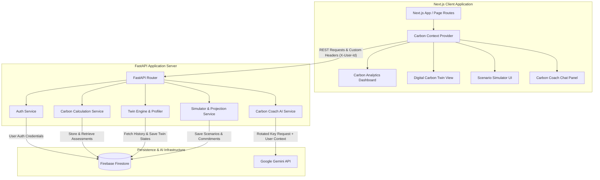

# CarbonTwin AI 🌿


> **CarbonTwin AI is a next-generation, AI-powered climate intelligence suite.** It creates an interactive, explainable **Digital Carbon Twin** of a user's household carbon footprint, allowing them to track emissions, run real-time multi-year lifestyle simulations, and consult an AI Sustainability Coach powered by Google Gemini.

## 🚀 Live Demo

- **Frontend Application:** [https://carbon-twin-frontend-92195738880.asia-south1.run.app](https://carbon-twin-frontend-92195738880.asia-south1.run.app)
- **Backend API:** [https://carbon-twin-backend-92195738880.asia-south1.run.app/health](https://carbon-twin-backend-92195738880.asia-south1.run.app/health)

---

## 📌 Project Overview

CarbonTwin AI bridges the gap between passive carbon calculators and active lifestyle change. By compiling raw transportation, utility, diet, and consumption metrics into a reactive twin profile, it provides users with a clear roadmap to reduce emissions, save money, and offset carbon impact. It goes beyond simple metrics, giving you an interactive "twin" that reflects the environmental impact of your daily choices.

---

## ⚠️ Problem Statement

Personal carbon tracking is currently limited by:
- **Static Calculations:** Existing footprint calculators provide a single metric without explainable feedback or tracking.
- **Lack of Long-Term Context:** Users cannot see how modest changes (e.g., carpooling twice a week) scale over 1, 5, or 10 years.
- **Generic Recommendations:** Eco-actions are static list items that ignore local feasibility constraints and household size.
- **No Persistence:** Scenarios are lost upon closing the page, preventing progress tracking.

---

## 💡 Solution

CarbonTwin AI offers a holistic solution by introducing:
- **Digital Twin Engine:** A deterministic simulation engine projecting **Current**, **Future (Committed)**, and **Potential (Max Optimized)** states across a decade.
- **Explainable Analytics:** Displays trees planted, currency saved, and percentage reductions dynamically.
- **Interactive Scenarios:** A sandbox simulator containing toggles for solar panels, diet transitions, flights, electric vehicles, and public transit.
- **Context-Retrieval Coach:** A global, secure AI assistant that uses actual database inputs to coach users on their specific emission categories.

---

## 🌟 Key Features

* **Carbon Footprint Assessment:** A comprehensive journaling wizard across four modules: Transportation, Home Energy, Food, and Shopping.
* **Carbon Score Engine:** Normalizes household footprint metrics on an explainable scale from `0` (worst) to `100` (best).
* **Digital Carbon Twin:** A behavioral replica classifying users into archetypes and projecting their future emissions.
* **Personalized Action Plans:** Step-by-step eco-actions recommended based on the user's highest emission categories.
* **Gemini AI Sustainability Assistant:** A globally available floating chat coach powered by Google Gemini.
* **AI Insights Generator:** Custom-tailored insights evaluating strengths, weaknesses, risks, and opportunities.
* **Scenario Simulator:** A multi-lever playground projecting tree equivalents, money saved, and payback horizons.
* **Carbon Analytics Dashboard:** Rich charts displaying carbon breakdowns and historical progress.
* **Sustainability Recommendations:** Feasibility-based actions ranked dynamically.
* **Secure Authentication:** Complete credential login and Google OAuth federation.
* **Accessibility Support:** High-contrast designs, full keyboard navigation, and ARIA labels.

---

## 🏗️ Architecture



---

## 💻 Technology Stack

### Frontend
- Next.js (React, App Router)
- TypeScript
- Tailwind CSS
- NextAuth.js (Auth.js v5)
- Recharts (Visualizations)

### Backend
- FastAPI (Python)
- Pydantic v2
- Pytest
- Uvicorn

### Database & Persistence
- Firebase Firestore (NoSQL Document Store)
- Firebase Admin SDK

### AI & LLM Integration
- Google GenAI SDK (`google-genai`)
- Gemini 2.5 Flash / Pro Models

### Deployment
- Google Cloud Run (Containerized Microservices)
- Google Artifact Registry

---

## 🤖 AI Components

### Context-Retrieval Coach
CarbonTwin AI integrates Google Gemini to provide a floating, always-available AI Sustainability Coach. The coach is context-aware: it reads a user's exact footprint assessment, recent simulation changes, and twin archetype to deliver extremely personalized advice.

### AI Insights Generator
Leveraging the latest Gemini models, the insights generator evaluates user strengths, weaknesses, risks, and opportunities on the fly, translating raw carbon emissions into a cohesive narrative.

---

## 📊 Carbon Calculation System

### Data Collection
Users submit records via four key modules:
- **Transportation:** Ground distances (km or miles), vehicle fuels (gasoline, diesel, hybrid, electric), and flight airport routes.
- **Home Energy:** Monthly electricity utility bills, appliance power ratings/usage, and solar panels.
- **Food:** Detailed meal diaries specifying meat types, dairy, and vegetables.
- **Shopping:** Monthly clothing, electronics purchases, package courier delivery counts, and vehicle purchases.

### Carbon Scoring
Normalizes total footprint tons against baseline bounds:
- Footprints $\le 2.0$ tons receive a score of `100`.
- Footprints $\ge 20.0$ tons receive a score of `0`.
- Intermediate values scale linearly: $\text{Score} = 100 - \frac{\text{Tons} - 2}{18} \times 100$.

---

## 🧬 Carbon Twin Digital Twin Engine

The Digital Carbon Twin acts as a behavioral replica, updating in real-time as users log new data. 

**User Profiling Engine:**
A deterministic profiling engine assigns users into archetypes based on behavior patterns:
- **Frequent Flyer:** $\ge 3$ flights or $> 2,000$ kg CO₂e in aviation.
- **High Consumption Shopper:** Shopping emissions $> 1,500$ kg CO₂e or $> 6$ deliveries/week.
- **Urban Transit Optimizer:** public transit/walking $\ge 60\%$ of ground commute, or owns an electric vehicle.
- **Energy Efficient Household:** Energy emissions $< 500$ kg CO₂e or Medium/Large solar setup.
- **Balanced Sustainable User:** Fallback for moderate impact.

---

## 🎮 Impact Simulator

The Scenario Simulator allows users to manipulate multi-lever variables in a sandbox environment:
- Toggle solar panels, diet transitions, flights, electric vehicles, and public transit.
- Calculates emissions adjustments.
- Projects financial metrics (payback period, ROI) when levers are toggled.
- Displays equivalent metrics such as "trees planted" or "cars off the road."

---

## ✨ Personalized Recommendations

The Recommendation Engine sorts eco-actions by feasibility and category. It calculates potential impact based on user-submitted data, ranking actions dynamically so that users focus on the easiest and most impactful changes first. Active commitments are stored and applied to future projection states.

---

## 🔐 Authentication System

- **Secure Flow:** Features full credential login and Google OAuth federation using Auth.js.
- **API Protection:** Custom Next.js API proxy routes and header-based isolation (`X-User-Id`) protect REST endpoints.
- **Environment Isolation:** Secrets and API keys remain safely on the backend, rotating if needed.
- **Session Integrity:** Uses JWTs for session management. 

---

## ☁️ Deployment Architecture

Both the backend and frontend are fully containerized for production deployment on Google Cloud Run.
- **Backend:** A lightweight FastAPI service deployed via Google Artifact Registry.
- **Frontend:** A Next.js standalone multi-stage build mapped with API proxy configurations to seamlessly route requests to the backend under a unified domain setup or strict CORS structure.

---

## 🛠️ Installation

### 1. Clone Repository
```bash
git clone https://github.com/AniruddhaGhosh64/carbon-twin-ai.git
cd carbon-twin-ai
```

### 2. Backend Setup
```bash
cd backend
python -m venv venv
# On Windows
.\venv\Scripts\activate
# On Linux/macOS
source venv/bin/activate

pip install -r requirements.txt
```

### 3. Frontend Setup
```bash
cd ../frontend
npm install
```

---

## 💻 Local Development

1. **Environment Variables:**
   - Create `backend/.env` containing your database keys, `JWT_SECRET`, and Gemini API keys.
   - Create `frontend/.env.local` containing `NEXTAUTH_SECRET`, Google OAuth IDs, and `NEXT_PUBLIC_API_URL=http://localhost:8000`.

2. **Run Backend:**
   ```bash
   cd backend
   uvicorn app.main:app --reload
   ```

3. **Run Frontend:**
   ```bash
   cd frontend
   npm run dev
   ```

---

## 🚀 Production Deployment

### Google Cloud Run Deployment

**Deploy the Backend:**
```bash
cd backend
gcloud builds submit --tag gcr.io/YOUR_PROJECT_ID/carbontwin-backend
gcloud run deploy carbontwin-backend \
    --image gcr.io/YOUR_PROJECT_ID/carbontwin-backend \
    --platform managed \
    --allow-unauthenticated \
    --set-env-vars="GEMINI_API_KEY_1=your_key,FIREBASE_PROJECT_ID=your_id,JWT_SECRET=your_secret,FRONTEND_URL=https://your-frontend.run.app"
```

**Deploy the Frontend:**
```bash
cd frontend
gcloud builds submit --tag gcr.io/YOUR_PROJECT_ID/carbontwin-frontend
gcloud run deploy carbontwin-frontend \
    --image gcr.io/YOUR_PROJECT_ID/carbontwin-frontend \
    --platform managed \
    --allow-unauthenticated \
    --set-env-vars="NEXT_PUBLIC_API_URL=https://your-backend.run.app,AUTH_SECRET=your_secret,AUTH_TRUST_HOST=true"
```

---

## 📸 Screenshots

Here is a closer look at the CarbonTwin AI interface:

### Dashboard


### My Footprint


### Carbon Twin


### Impact Simulator


### Eco Actions


### Progress


---

## 🗺️ Future Scope

- **Advanced Carbon Twin Intelligence:** Integrating machine learning predictions based on historical usage data.
- **Predictive Emissions Forecasting:** Integrating local weather data to forecast winter heating and summer cooling emissions.
- **Personalized Roadmaps:** Dynamic timelines suggesting when to purchase solar panels or replace old appliances.
- **PDF Sustainability Reports:** Generating downloadable climate compliance summaries.
- **Enhanced AI Recommendations:** Direct integrations with green retailers and smart home ecosystems.

---

## 🤝 Contributing & License

Contributions are welcome! Please submit a pull request or open an issue to suggest enhancements.

This project is licensed under the MIT License - see the LICENSE file for details.
