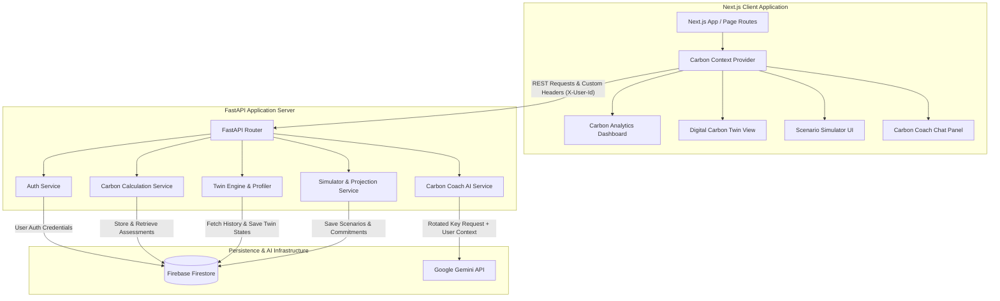

# CarbonTwin AI 🌿

CarbonTwin AI is a next-generation, AI-powered climate intelligence suite. It creates an interactive, explainable **Digital Carbon Twin** of a user's household carbon footprint, allowing them to track emissions, run real-time multi-year lifestyle simulations, and consult an AI Sustainability Coach powered by Google Gemini.

---

## 📌 Overview

CarbonTwin AI bridges the gap between passive carbon calculators and active lifestyle change. By compiling raw transportation, utility, diet, and consumption metrics into a reactive twin profile, it provides users with a clear roadmap to reduce emissions, save money, and offset carbon impact.

---

## ⚠️ Problem Statement

Personal carbon tracking is currently limited by:
- **Static Calculations:** Existing footprint calculators provide a single metric without explainable feedback or tracking.
- **Lack of Long-Term Context:** Users cannot see how modest changes (e.g., carpooling twice a week) scale over 1, 5, or 10 years.
- **Generic Recommendations:** Eco-actions are static list items that ignore local feasibility constraints and household size.
- **No Persistence:** Scenarios are lost upon closing the page, preventing progress tracking.

---

## 💡 Solution

CarbonTwin AI offers a holistic solution by introducing:
- **Digital Twin Engine:** A deterministic simulation engine projecting **Current**, **Future (Committed)**, and **Potential (Max Optimized)** states across a decade.
- **Explainable Analytics:** Displays trees planted, currency saved, and percentage reductions dynamically.
- **Interactive Scenarios:** A sandbox simulator containing toggles for solar panels, diet transitions, flights, electric vehicles, and public transit.
- **Context-Retrieval Coach:** A global, secure AI assistant that uses actual database inputs to coach users on their specific emission categories.

---

## 🌟 Key Features

* **Carbon Footprint Assessment:** A comprehensive journaling wizard across four modules: Transportation, Home Energy, Food, and Shopping.
* **Carbon Score Engine:** Normalizes household footprint metrics on an explainable scale from `0` (worst) to `100` (best).
* **Digital Carbon Twin:** A behavioral replica classifying users into archetypes and projecting their future emissions.
* **Personalized Action Plans:** Step-by-step eco-actions recommended based on the user's highest emission categories.
* **Gemini AI Sustainability Assistant:** A globally available floating chat coach powered by Google Gemini.
* **AI Insights Generator:** Custom-tailored insights evaluating strengths, weaknesses, risks, and opportunities.
* **Scenario Simulator:** A multi-lever playground projecting tree equivalents, money saved, and payback horizons.
* **Carbon Analytics Dashboard:** Rich charts displaying carbon breakdowns and historical progress.
* **Sustainability Recommendations:** Feasibility-based actions ranked dynamically.
* **Secure Authentication:** Complete credential login and Google OAuth federation.
* **Accessibility Support:** High-contrast designs, full keyboard navigation, and ARIA labels.

---

## 🏗️ Architecture



---

## 🧬 Digital Carbon Twin Logic

### 1. Data Collection
Users submit records via four key modules:
- **Transportation:** Ground distances (km or miles), vehicle fuels (gasoline, diesel, hybrid, electric), and flight airport routes.
- **Home Energy:** Monthly electricity utility bills, appliance power ratings/usage, and solar panels.
- **Food:** Detailed meal diaries specifying meat types, dairy, and vegetables.
- **Shopping:** Monthly clothing, electronics purchases, package courier delivery counts, and vehicle purchases.

### 2. Carbon Scoring
Normalizes total footprint tons against baseline bounds:
- Footprints $\le 2.0$ tons receive a score of `100`.
- Footprints $\ge 20.0$ tons receive a score of `0`.
- Intermediate values scale linearly: $\text{Score} = 100 - \frac{\text{Tons} - 2}{18} \times 100$.

### 3. User Profiling
A deterministic profiling engine assigns users into archetypes:
- **Frequent Flyer:** $\ge 3$ flights or $> 2,000$ kg CO₂e in aviation.
- **High Consumption Shopper:** Shopping emissions $> 1,500$ kg CO₂e or $> 6$ deliveries/week.
- **Urban Transit Optimizer:** public transit/walking $\ge 60\%$ of ground commute, or owns an electric vehicle.
- **Energy Efficient Household:** Energy emissions $< 500$ kg CO₂e or Medium/Large solar setup.
- **Balanced Sustainable User:** Fallback for moderate impact.

### 4. Recommendation Engine
Sorts eco-actions by feasibility and category. Calculates impact based on user-submitted data.

### 5. Scenario Simulation
Calculates emissions adjustments and calculates financial metrics (payback period, ROI) when levers are toggled.

---

## 💻 Tech Stack

### Frontend
- Next.js (React, App Router)
- TypeScript
- Tailwind CSS
- NextAuth.js
- Recharts (visualizations)

### Backend
- FastAPI (Python 3.14)
- Pydantic v2
- Pytest
- Uvicorn

### Database & Persistence
- Firebase Firestore (NoSQL Document Store)
- Firebase Admin SDK

### AI & LLM Integration
- Google GenAI SDK (`google-genai`)
- Gemini 2.5 Flash / Pro Models

### Deployment
- Google Cloud Run (Containerized Microservices)
- Google Artifact Registry

---

## 📂 Folder Structure

```
project-root/
├── backend/                  # FastAPI Python Backend
│   ├── app/
│   │   ├── api/              # API Route Handlers
│   │   ├── core/             # Configuration & Rate Limiting
│   │   ├── repositories/     # Firestore Database Operations
│   │   ├── schemas/          # Pydantic Schemas & Validations
│   │   └── services/         # Calculation & Twin Projections
│   ├── tests/                # Pytest Suite (48 Unit Tests)
│   ├── pyproject.toml        # Pyrefly & Pyright Config
│   ├── requirements.txt      # Python Package Dependencies
│   └── uvicorn_server.py     # Main Runner
├── frontend/                 # Next.js React Frontend
│   ├── public/               # Asset Files
│   ├── src/
│   │   ├── app/              # Dashboard, Twin & Footprint pages
│   │   ├── components/       # Layout, Footprint & UI elements
│   │   ├── context/          # CarbonContext.tsx State Provider
│   │   ├── data/             # Air airports & Consumption presets
│   │   └── lib/              # Utility helpers
│   ├── package.json          # Node Modules
│   └── tsconfig.json         # TypeScript Compiler Options
├── README.md                 # Project Documentation (This File)
└── .gitignore                # Root Ignored Files
```

---

## 🔌 API Endpoints

### 🔐 Authentication (`/api/v1/auth`)
* `POST /register`: Registers a new user.
* `POST /login`: authenticates local credentials.
* `POST /google-login`: Validates and links federated Google accounts.

### 📊 Carbon Footprints (`/api/v1/footprint`)
* `POST /calculate`: Validates data and returns real-time calculations.
* `POST /save`: Saves carbon assessment data.
* `GET /latest`: Fetches the latest assessment score.
* `GET /assessment/latest`: Fetches raw latest assessment answers.

### 🧬 Carbon Twin Engine (`/api/v1/carbontwin`)
* `GET /latest`: Returns current, future, and potential states.
* `POST /generate`: Rebuilds twin profiles and accepts custom adopted rule IDs.
* `POST /chat`: AI Assistant chat completion endpoint with history.

### 📈 Recommendations & Commitments (`/api/v1/dashboard`)
* `POST /generate`: Analyzes categories and returns ranked recommendations.
* `GET /commitments`: Retrieves a list of active commitments.
* `POST /commit`: Toggles a specific recommendation action.
* `POST /commit_simulation`: Saves all current simulator lever presets.

### 🎮 Simulator Engine (`/api/v1/simulator`)
* `POST /project`: Accepts custom levers and calculates simulated emissions.
* `GET /scenarios`: Lists all custom saved scenarios.
* `POST /scenarios`: Saves a custom scenario preset.

---

## 🔒 Security

* **Environment Variables:** All credentials (API keys, Firestore details) are isolated inside backend-only `.env` files.
* **Secret Management:** Google API Keys are rotated on the backend. No secret credentials are exposed to the client application.
* **Input Validation:** Pydantic schemas enforce type-safety. Inputs are sanitized against XSS using character escapes.
* **API Protection:** An custom X-User-Id header isolates assessments and endpoints.
* **Authentication:** NextAuth validates credentials, keeping session JSON Web Tokens secure.
* **Rate Limiting:** IP and User bucket rate limiters prevent LLM billing exhaustion (e.g. 10 messages/min).

---

## ♿ Accessibility

* **ARIA Labels:** Interactive elements use `aria-label`, `aria-pressed`, `aria-checked`, and `aria-expanded` attributes.
* **Keyboard Navigation:** Inputs, toggles, buttons, and range sliders support focus rings (`focus-visible:ring-2`).
* **Color Contrast:** Layout follows AA compliance using dark-mode tailored themes.
* **Screen Reader Support:** Dialog panels are tagged with `role="dialog"` and `aria-modal="false"`.

---

## 🧪 Testing

### Running Tests
The backend contains 48 unit and integration tests.

```bash
# Navigate to backend
cd backend

# Activate virtual environment
.\venv\Scripts\activate

# Run Pytest suite
pytest -v
```

---

## 🚀 Installation

### 1. Clone Repository
```bash
git clone https://github.com/your-username/carbon-twin-ai.git
cd carbon-twin-ai
```

### 2. Backend Setup
```bash
cd backend
python -m venv venv
.\venv\Scripts\activate
pip install -r requirements.txt
uvicorn app.main:app --reload
```

### 3. Frontend Setup
```bash
cd ../frontend
npm install
npm run dev
```

---

## 📄 Environment Variables

Create a `.env` file in the `backend/` directory:

```env
GEMINI_API_KEY=your_gemini_api_key
GEMINI_API_KEY_1=optional_backup_key_1
GEMINI_API_KEY_2=optional_backup_key_2
FIREBASE_PROJECT_ID=your_firebase_project_id
FIREBASE_CREDENTIALS_PATH=path/to/firebase-credentials.json
JWT_SECRET=your_jwt_signing_secret
```

Create a `.env.local` file in the `frontend/` directory:

```env
NEXTAUTH_SECRET=your_nextauth_signing_secret
NEXTAUTH_URL=http://localhost:3000
NEXT_PUBLIC_API_URL=http://127.0.0.1:8000
```

---

## ☁️ Deployment

### Docker Configuration
Both the backend and frontend are fully containerized for production deployment.

- **Backend:** `backend/Dockerfile` builds a lightweight FastAPI service using a non-root user.
- **Frontend:** `frontend/Dockerfile` utilizes a Next.js multi-stage build that packages the standalone output for an optimized footprint.

### Google Cloud Run Deployment

**Deploy the Backend:**
```bash
cd backend
gcloud builds submit --tag gcr.io/your-project-id/carbontwin-backend
gcloud run deploy carbontwin-backend \
    --image gcr.io/your-project-id/carbontwin-backend \
    --platform managed \
    --allow-unauthenticated \
    --set-env-vars="GEMINI_API_KEY=your_key,FIREBASE_PROJECT_ID=your_id"
```

**Deploy the Frontend:**
```bash
cd frontend
gcloud builds submit --tag gcr.io/your-project-id/carbontwin-frontend
gcloud run deploy carbontwin-frontend \
    --image gcr.io/your-project-id/carbontwin-frontend \
    --platform managed \
    --allow-unauthenticated \
    --set-env-vars="NEXT_PUBLIC_API_URL=https://your-backend-url.run.app"
```

Live Demo:
[TODO: Add deployed URL]

---

## ⚡ Performance Optimizations

- **Parallel Fetches:** Frontend Context API triggers asynchronous parallel requests (`Promise.allSettled`) to retrieve twin profiles, calculations, and recommendations concurrently.
- **Reloader Process:** Backend uses WatchFiles in development, automatically picking up changed schemas and API routers.
- **Memoized Calculations:** Heavy carbon footprint algorithms run client-side where possible to reduce server load.

---

## 🗺️ Future Roadmap

- **Advanced Carbon Twin Intelligence:** Integrating machine learning predictions based on historical usage data.
- **Predictive Emissions Forecasting:** Integrating local weather data to forecast winter heating and summer cooling emissions.
- **Personalized Roadmaps:** Dynamic timelines suggesting when to purchase solar panels or replace old appliances.
- **PDF Sustainability Reports:** Generating downloadable climate compliance summaries.
- **Enhanced AI Recommendations:** Direct integrations with green retailers.

---

## 📸 Screenshots

*Baseline Dashboard Layout*


*Digital Twin Evolution Sandbox*


*Interactive Scenario Projection*


---

## 🤝 Contributing

Contributions are welcome! Please submit a pull request or open an issue to suggest enhancements.

---

## 📄 License

This project is licensed under the MIT License - see the LICENSE file for details.
